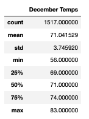
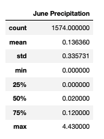
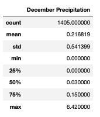

# surfs_up

## Overview/Purpose of the analysis: 
   * In order to determine if the W. Avy's surf and ice cream shop business will be sustainable year-round in Oahu, temperatures for June and December were queried and analyzed leveraging SQL Alchemy and Python. This written report describes the key differences in weather between June and December and two recommendations for further analysis.

## Results: 
   * **Deliverable 1: Determine the Summary Statistics for June**
     * The sqlalchemy **extract** function and Python were used to query June temperature data from our sql file. Once the query was successful, we created a dataframe that only contained the data we needed to analyze. Once we obtained our dataframe ("june_temp_df"), we were able to calculate and print out the summary statistics. See below image. 
       *    
     * Referencing the image above, there are three main datapoints that can be made from the June Temperature query. 
       * June in Oahu has the perfect average temperature: With an average (mean) temp of ~75 degrees, there should be no concern over high temperatures causing customers to complain about sticky hands from melting icecream. 
       * Not too hot: Oahu's maximum temp of 85 degrees is still an enjoyable climate for surfing and lounging on the beach. 
       * Sweater Weather in the morning and evenings: With a minimum temperature of 64 degrees, a light sweater may be a coveted item, especially near the water. We definitely recommend selling some surf-shop light sweaters and/or windbreakers for customers who may have forgotten to pack one.      
   *  **Deliverable 2: Determine the Summary Statistics for December**
      * In order to determine the temperatures in December, the same process was used in using sqlalchemy and python. Below is an image of the December Summary Statistics.
        * 
      * Referencing the image above, there are three main datapoints that can be made from the December Temperature query. 
        * December in Oahu is not too different than June: With an average (mean) temp of ~71 degrees, December still has beautiful weather. With only an approximate 4 degree difference, W. Avy can be rest assured his customers will be comfortable and still in the mood for some icecream. 
        * Max temps in December similar to June: The max temp of ~83 in December is only a two degree difference than June. This is still an enjoyable climate for surfing and eating icecream. 
        * Min temps in December are lower than June: As pictured, a min temp of 56 degrees can be expected in December. This is an 8 degree difference when compared to June. Customers will likely be in need of a light jacket or sweater in the mornings and evenings. 

## Summary: 
   * Overall, W. Avy has little to worry about regarding avg, min, and max temperatures on the beautiful island of Oahu. Temperature wise, ice cream and surfing can be considered year long hobbies and guaranteed business. However, I would recommend conducting two additional queries for June and December, specifically focusing on precipitation to make sure business will be steady. Similar to how we pulled data for Temperature in June and December, using SQL Alchemy and Python I was able to conduct these two queries and retrieved the following summary data:
     *  
   * As depicted above, there is minimal differences in precipitation when comparing June and December. The biggest difference was evident in the maximum precipitation numbers. Other than that, Oahu will still likely be an amazing place to open and sustain a surf and ice cream shop year-round. 
