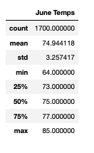

# surfs_up

For this part of the Challenge, write a report that describes the key differences in weather between June and December and two recommendations for further analysis.

The analysis should contain the following:

As a reminder, the deliverables for this Challenge are as follows:

Deliverable 1: Determine the Summary Statistics for June
Deliverable 2: Determine the Summary Statistics for December

## Overview/Purpose of the analysis: 
   * In order to determine if the W. Avy's surf and ice cream shop business will be sustainable year-round in Oahu, temperatures for June and December were queried and analyzed leveraging SQL Alchemy and Python. This written report describes the key differences in weather between June and December and two recommendations for further analysis.

## Results: 
   * Deliverable 1: Determine the Summary Statistics for June
     * The sqlalchemy **extract** function and Python were used to query June temperature data from our sql file. Once the query was successful, we created a dataframe that only contained the data we needed to analyze. Once we obtained our dataframe ("june_temp_df"), we were able to calculate and print out the summary statistics. See below image. 
     *    
     * As pictured above, there are three main datapoints that can be made from the query. 
       * June in Oahu is the perfect average temperature: With an average (mean) temp of ~75 degrees, there should be no concern over high temperatures causing customers to complain about sticky hands from melting icecream. 
       * Not too hot: Oahu's maximum temp of 85 degrees is still an enjoyable climate for surfing and lounging on the beach. 
       * Sweater Weather in the morning and evenings: With a minimum temperature of 64 degrees, a light sweater may be a coveted item, especially near the water. We definitely recommend selling some surf-shop light sweaters and/or windbreakers for customers who may have forgotten to pack one.        
    * Deliverable 2: Determine the Summary Statistics for December
      * 

## Summary: Provide a high-level summary of the results and two additional queries that you would perform to gather more weather data for June and December.
